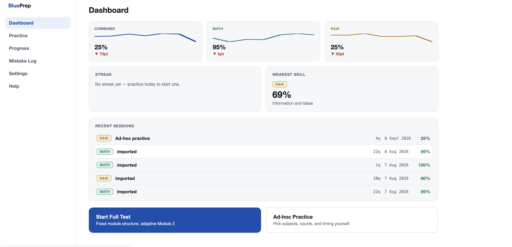
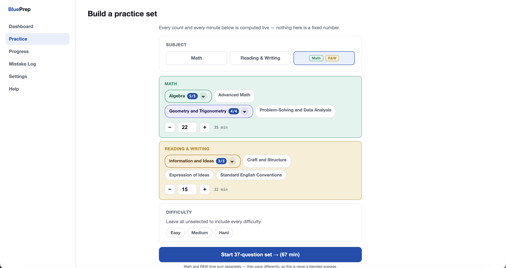
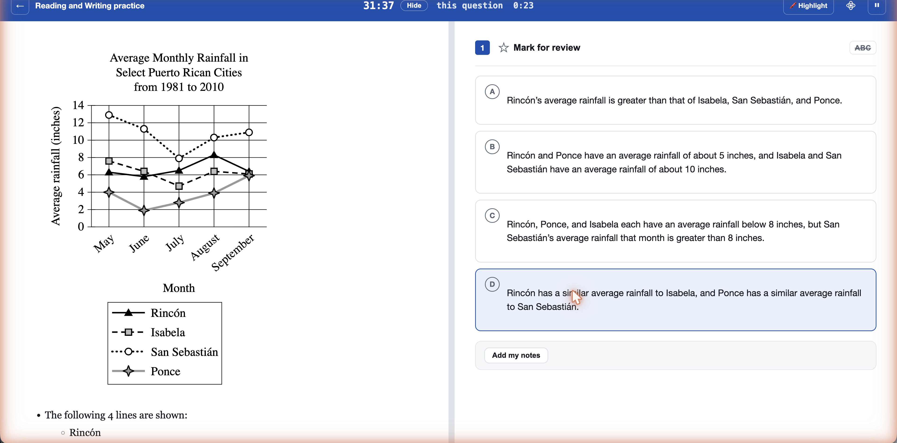
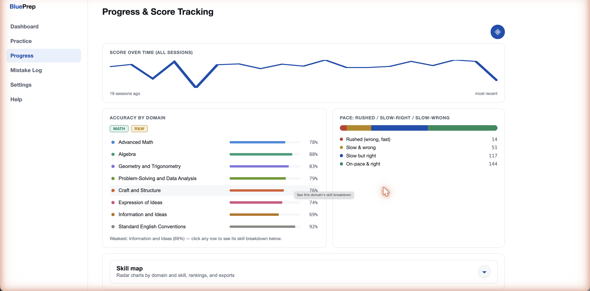

# BluePrep


-3ECF8E)


## Table of contents
- [What it is](#what-it-is)
- [Screenshots](#screenshots)
- [Core features](#core-features)
- [Real examples](#real-examples)
- [Tech stack](#tech-stack)
- [Why a trap/cue coaching system — not just right/wrong](#why-a-trapcue-coaching-system--not-just-rightwrong)
- [Running locally](#running-locally)
- [License](#license)

## What it is

BluePrep is a **Bluebook-style SAT practice player** built around a real, verified question bank — not synthetic or AI-generated questions. It reproduces the digital SAT's actual test-taking experience (adaptive Module 1 → Module 2 routing, real per-module pacing, the same reference sheet/calculator/highlighter workflow) while adding what the real test doesn't give you: a coaching layer that explains *why* a wrong answer is wrong, tracks progress by domain and skill over time, and lets you build a custom practice set filtered by exactly the topics you're weak in.

## Screenshots

**Dashboard** — score trend by section, streak, weakest skill, and recent sessions at a glance.


**Ad-hoc Practice Builder** — every count and minute below is computed live from real pool sizes, not fixed numbers. Domain chips expand into skill-level sub-filters.


**Practice Player** — the real Bluebook layout: resizable panes, per-question timer, mark-for-review, and a highlighter.


**Progress & Score Tracking** — accuracy broken down by all 8 real SAT domains, plus a rushed/slow/on-pace breakdown of every attempt.


## Core features

- **Real, verified question bank** — 3,252 questions pulled from the source's own public question-bank API, not generated. Includes inline `<svg>` diagrams, MathML notation, and grid-in (student-produced response) items, all rendered faithfully.
- **Full-length adaptive testing** — the real R&W M1 → R&W M2 → break → Math M1 → Math M2 structure, with Module 2 difficulty routed off live Module 1 performance, at official per-module pacing.
- **Ad-hoc practice builder** — filter by subject, domain, skill, and difficulty; every question count and time estimate is computed live against the actual matching pool, not a fixed number.
- **Trap/cue coaching** — inline highlights on the exact phrase in a question that signals a common trap, an unstated assumption, or the key "govern" clause — grounded in the source's own answer rationale, not generic tips.
- **Student highlighter and annotations** — draw, color, and underline highlights across the stimulus/stem/choices, plus a private note per question, both of which persist across sessions.
- **Progress analytics** — accuracy by domain and skill (radar charts), a rushed/slow-right/slow-wrong pace breakdown, and a ranked strongest/weakest list.
- **AI tutor (bring-your-own-key)** — an in-player "Ask AI" chat and a Progress-page "AI Coach," both proxied through OpenRouter with your own API key, so there's no server-side AI cost.
- **Mistake Log** — every wrong answer and every noted question in one place, with CSV/plain-text export for offline review.

## Real examples

The point of the coaching layer is that it's grounded in the actual question content, not generic advice. Some real examples from the live bank:

| What you see | What BluePrep actually does |
|---|---|
| A Craft and Structure question with a nested clause hiding the real subject | A `govern` cue highlights the clause that actually determines the answer, so a reflex reading of the sentence doesn't stick to the wrong noun |
| An Advanced Math question with a plausible but wrong "obvious" first step | A `trap` cue flags the exact operation a student is likely to try first, tied to a real `trap_categories` row (e.g. `wrong_operation_substitution`) |
| A Standard English Conventions question testing a rule that looks optional | An `assumption` cue calls out the unstated grammar rule the question is actually testing, sourced from the source's own choice-by-choice rationale |
| A grid-in (SPR) answer like `3/17` vs. `.1764` | Grading checks the submission against every mathematically accepted form, not a single string match — fixed after a real bug was found and verified against live examples |
| Building a 22-question Math set filtered to Algebra + Geometry, Easy only | The builder queries the live pool for that exact domain/skill/difficulty combination and shows a real "22 of 43 available" count before you start |

## Tech stack

- **Frontend**: React 19 + TypeScript + Vite, React Router, Recharts for analytics charts
- **Backend / data**: Supabase (Postgres + Auth + Row Level Security), Supabase Vault for encrypted API-key storage
- **AI**: OpenRouter (bring-your-own-key — student's key, not the app's), proxying ~400 models via one adapter
- **Hosting**: Vercel, auto-deploy on push to `main`

## Why a trap/cue coaching system — not just right/wrong

Most practice tools tell you whether you got a question right. BluePrep's `cues` table stores something more specific: for each cued question, the exact phrase in the stimulus, stem, or a choice that a trap or key insight hinges on — categorized as a `govern` (the clause that actually controls the answer), a `trap` (the wrong-but-plausible move), or an `assumption` (an unstated rule the question relies on). Every cue is grounded in the source's own per-choice rationale text, not an independently invented explanation — the goal is to make visible the reasoning the source's own answer key already contains but never surfaces to the student. As of this writing, 755 of the 3,252 questions in the bank have been cued (2,295 individual cue rows); the rest are generated on demand rather than upfront, since most questions in a 3,000+ bank are never actually seen by a given student.

## Running locally

<details>
<summary>Setup steps (click to expand)</summary>

The app lives in `web/`.

```bash
cd web
npm install
cp .env.example .env   # fill in your own Supabase project URL + publishable key
npm run dev
```

This starts the Vite dev server. `npm run build` produces a production build (`tsc -b && vite build`); `npm run lint` runs `oxlint`.

The Supabase schema (16 tables, RLS policies included) needed to run your own instance is not included in this repo as a single file to apply blind — see `blueprep_schema.sql` in the repo history for the original DDL, plus the migrations applied since. Running against a fresh Supabase project requires recreating that schema first.

</details>

## License

MIT — see [LICENSE](LICENSE).
